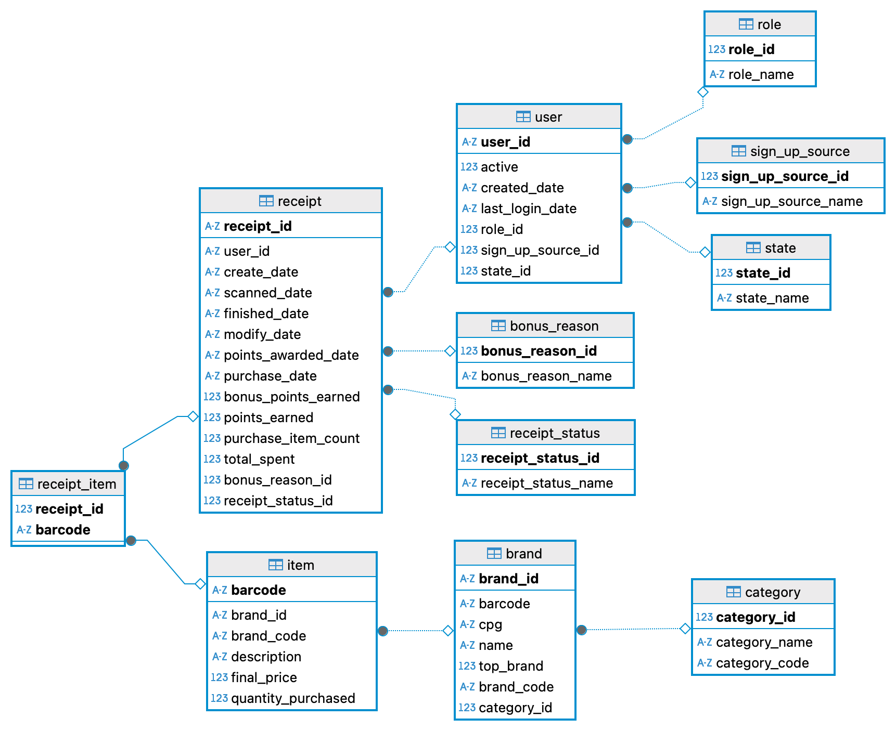

# Guidance
## Structured Relational Data Model Overview

## Table Information Overview

### receipt

**receipt_id**: **primary key**, unique id for this receipt   
**user_id**: **foreign key** from user table, unique id for user  
**bonus_reason_id**: **foreign key** from bonus_reason table, unique id for bonus points earned reason  
**receipt_status_id**: **foreign key** from receipt_status table, unique id for rewards receipt status  
**create_date**: the date that the event was created    
**scanned_date**: date that the user scanned their receipt  
**finished_date**: date that the receipt finished processing 
**modify_date**: the date the event was modified  
**points_awarded_date**: the date we awarded points for the transaction 
**purchase_date**: the date of the purchase 
**bonus_points_earned**: the number of bonus points earned for the receipt  
**points_earned**: the number of points earned for the receipt  
**purchase_item_count**: count of number of items on the receipt 
**total_spent**: the total amount on the receipt  

### bonus_reason

**bonus_reason_id**: **primary key**, unique id for this bonus reason    
**bonus_reason_name**: the description of the receipt bonus point earned reason   

### receipt_status

**receipt_status_id**: **primary key**, unique id for this status     
**receipt_status_name**: the name of current receipt status  

### brand

**brand_id**: **primary key**, unique id for brand  
**category_id**: **foreign key** from category table, unique id for category_name and category_code  
**barcode**: brand barcode  
**cpg**: reference to CPG collection  
**name**: brand name  
**top_brand**: boolean indicator for whether the brand should be featured as a 'top brand'    
**brand_code**: string that corresponds with the brand column in a partner product file  

### user

**user_id**: **primary key**, unique id for user  
**role_id**: **foreign key** from role table, unique id for role_name  
**state_id**: **foreign key** from state table, unique id for state_name  
**sign_up_source_id**: **foreign key** from sign_up_source table, unique id for sign_up_source_name  
**active**: indicates if the user is active; only Fetch will de-activate an account with this flag  
**created_date**: when the user created their account  
**last_login_date**: last time the user was recorded logging in to the app  

### role

**role_id**: **primary key**, unique id for this role   
**role_name**: the name of current role  

### sign_up_source

**sign_up_source_id**: **primary key**, unique id for this sign up source   
**sign_up_source_name**: the name of the source when sign up  

